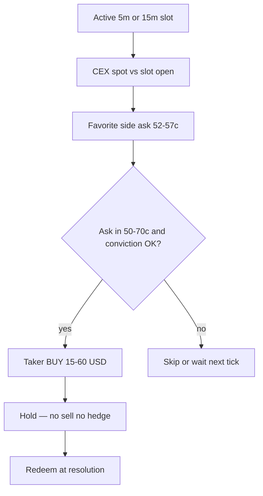
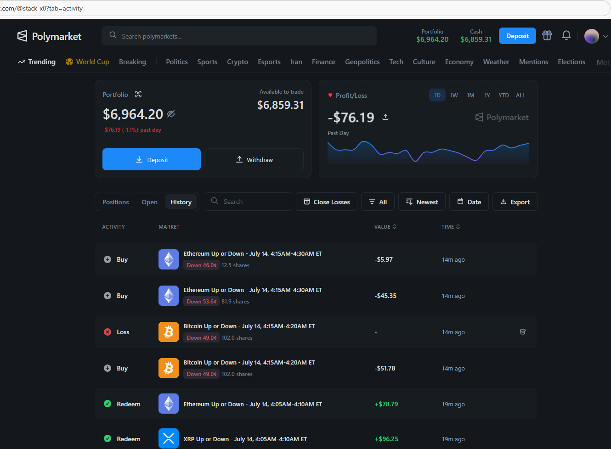
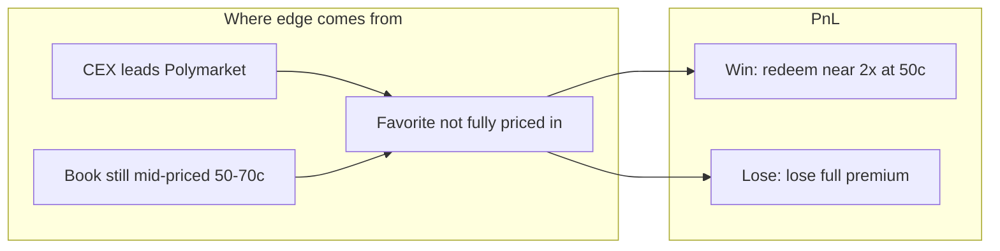
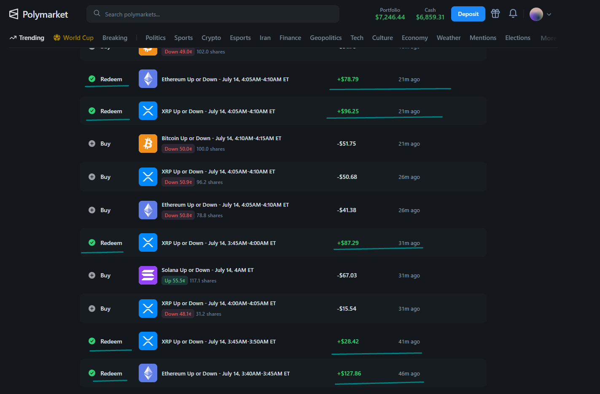

# STACK-X0 — Polymarket Crypto Up/Down Bot

Automated trading engine for Polymarket **crypto Up/Down** markets (BTC, ETH, SOL, XRP — **5m** and **15m** windows). Strategy core:

> **One side. One entry band. Hold to redeem. Never sell. Never hedge.**

For every active slot the bot:

1. Reads **direction** from CEX lead vs slot open (`spot − open` gap)
2. Identifies the **favorite** side (book prices it ~**52–57¢**)
3. If favorite ask ∈ **[50¢, 70¢]** and conviction is OK → **taker BUY ~$15–$60** (~50–100 shares)
4. **Holds to resolution** → redeem **$1** if correct, **$0** if wrong
5. **Never sells**, **never buys the opposite side**

Built on **[@stack-x0](https://polymarket.com/@stack-x0)** and wallet `0x9a07c6583fb9defd31a102add491d35621c404e1`.

> **Disclaimer:** Observed public patterns + an independent reimplementation. **Not financial advice.** Past results do not guarantee future performance. Start with simulation and micro-size live clips.

---

## Table of contents

1. [Strategy in one page](#strategy-in-one-page)
2. [Why this can be profitable](#why-this-can-be-profitable)
3. [The math — edge, fees, break-even](#the-math--edge-fees-break-even)
4. [Conviction and the entry band](#conviction-and-the-entry-band)
5. [What we do not do](#what-we-do-not-do)
6. [What kills the edge](#what-kills-the-edge)
7. [Visual walkthrough (screenshots)](#visual-walkthrough-screenshots)
8. [How the bot implements it](#how-the-bot-implements-it)
9. [Quick start](#quick-start)
10. [Configuration](#configuration)
11. [Simulation and validation](#simulation-and-validation)
12. [Production](#production)
13. [Architecture](#architecture)
14. [Further reading](#further-reading)

---

## Strategy in one page

```
For each active crypto up/down slot (BTC / ETH / SOL / XRP, 5m or 15m):

  1. Read direction from CEX lead vs slot open (spot vs open gap)
  2. Identify the FAVORITE side (book prices it 52–57¢)
  3. If favorite ask ∈ [0.50, 0.70] and conviction OK:
       → TAKER BUY ~$15–$60 (~50–100 shares)
  4. Hold to resolution → redeem $1 if correct, $0 if wrong
  5. Never sell, never hedge opposite side
```



| Step | Input | Decision |
|------|--------|----------|
| Direction | Binance/Coinbase (etc.) spot vs Polymarket **price to beat** | `gap > 0` → lean **UP**; `gap < 0` → lean **DOWN** |
| Favorite | Book mid / best ask on that side ~**52–57¢** | Confirms the market agrees with direction (mild favorite, not a done deal) |
| Entry | Best ask ∈ **[0.50, 0.70]** + conviction OK | Size **~$15–$60** (~**50–100** shares) as **FOK/taker** |
| Exit | Slot resolves | Redeem winners at **$1**; losers expire worthless |

**Stack-X0 profile context**



*The `@stack-x0` profile shows a live wallet around `$6.9k` portfolio / `$6.8k` cash and a recent activity stream dominated by mid-band crypto Up/Down buys. The visible rows include entries such as ETH Down `46.0¢` / `53.6¢` and BTC Down `49.0¢`, matching the “favorite/mid-band, hold-to-redeem” style this README documents.*

---

## Why this can be profitable

This is **not** endgame noise farming (sweeping 94–99¢) and **not** lottery spray (buying 3–30¢ losers). It is a **mid-band favorite trade**:

- You buy when the book and CEX already agree on a **mild favorite**.
- You pay roughly **50–70¢** per share for a claim that pays **$1** if you are right.
- Gross payoff on a winning entry at **55¢** is about **+82%** on capital deployed (before fees).
- Gross payoff on a losing entry is **−100%** of that clip.

Profitability comes from **asymmetric dollars per win vs loss at moderate prices**, combined with **repeated slots** across assets:

| Outcome | Example buy @$55 / 80 shares | Cash flow |
|---------|------------------------------|-----------|
| Correct | Cost **$44**; redeem **$80** | **+$36** (~+82% gross) |
| Wrong | Cost **$44**; redeem **$0** | **−$44** |

Because wins pay **more dollars than losses lose on the same size** only if win rate stays high enough after fees — otherwise the strategy loses. Mid-band favorites aim for that: the CEX gap + book confirmation filters coin-flips; you skip both razor-thin 99¢ clips and cheap underdog lottery tickets.



**Core claim (expectancy):**

If, after fees, your long-run win rate on these mid-band favorites exceeds the break-even rate for your average entry price, the strategy has positive expectancy. Volume (many BTC/ETH/SOL/XRP slots) then compounds that edge.

**Winning-history evidence**



*The history screenshot shows the exact mechanics: mid-band buys around `48–55¢` and later green `Redeem` rows. Examples visible in the screenshot include XRP and ETH redemptions around `+$78.79`, `+$96.25`, `+$87.29`, `+$28.42`, and `+$127.86`. This is the core cash-flow path: buy one side, wait, redeem if correct.*

---

## The math — edge, fees, break-even

### Gross vs net after taker fees

FOK buys are **takers**. Crypto 5m/15m fee rate ≈ **0.072**:

```
feeShares = shares × 0.072 × price × (1 − price)
netEdgePerShare = 1 − price − (0.072 × price × (1 − price))
```

| Favorite ask | Gross if win `(1−p)/p` | Approx. net edge / share if win | Break-even win rate\* |
|--------------|------------------------|----------------------------------|------------------------|
| **50¢** | **+100%** | ~+48¢ | ~52% |
| **55¢** | **+82%** | ~+43¢ | ~55–56% |
| **60¢** | **+67%** | ~+38¢ | ~58–59% |
| **65¢** | **+54%** | ~+33¢ | ~61–62% |
| **70¢** | **+43%** | ~+28¢ | ~64–65% |

\*Rough (premium risk / (premium + net win)); actual break-even rises slightly after fee share haircuts on fills. Use sim logs to calibrate your live filled prices.

**Read this carefully:** at **70¢** you need a **much higher** hit rate than at **50¢**. That is why the band is capped at **0.70** — above that, edges shrink and break-even win rates climb into “almost resolved” territory where you are paying too much for residual upside.

### Worked example — one slot, one clip

```
CEX: BTC spot $98,420   Slot open (price to beat): $98,380
Gap: +$40 → lean UP

Book: UP best ask 0.54   DOWN best ask 0.47
Favorite: UP (~54¢ in the 52–57¢ “mild favorite” zone)
Ask in [0.50, 0.70]: yes
Conviction: gap + book agreement OK

→ TAKER BUY 80 shares UP @ 0.54  (~$43.20 notional)

If UP wins:  redeem ~$80  − fees  → ~+$35 profit
If UP loses: redeem $0            → ~−$43 loss
Never BUY DOWN. Never SELL UP.
```

### Why size is $15–$60 (not $2 micro-clips)

This strategy sizes **enough to make mid-band edge matter**, but **small enough that one wrong slot does not sink the wallet**:

| Size | Shares @ 55¢ | Win PnL (gross) | Loss PnL |
|------|--------------|-----------------|----------|
| $15 | ~27 | ~+$12 | −$15 |
| $30 | ~55 | ~+$25 | −$30 |
| $60 | ~109 | ~+$49 | −$60 |

~**50–100 shares** at mid-band prices lands in this notional range by design.

**Profile / analytics**


*Use the profile view to track wallet health: portfolio, cash available, one-day PnL, and the most recent unresolved buys. For this strategy, the most important KPI is not trade count — it is hit rate by average filled price.*

---

## Conviction and the entry band

### Direction (CEX lead)

```
gap = spot − openPrice
gap > 0  → candidate UP
gap < 0  → candidate DOWN
```

Optional filter: require `|gap| ≥ STACK_X0_MIN_GAP_USD` so flat open ≈ coin-flip slots are skipped.

### Favorite identification (52–57¢)

The **favorite** is the side the book already leans toward — typically mid ~**52–57¢** (not 90¢ endgame, not 20¢ lottery). That band means:

- The market is **not** undecided coin-flip at 50/50 forever.
- The move is **not** fully baked into a 90¢+ ask yet (still room to `$1`).

### Entry gate [50¢, 70¢]

| Price too low (&lt; 50¢) | Why skip |
|-------------------------|----------|
| Book disagrees or stale | May be underdog / trap, not confirmed favorite |

| Price too high (&gt; 70¢) | Why skip |
|-------------------------|----------|
| Thin upside vs capital | Break-even win rate gets harsh; resembles buying near-resolution |

### One entry philosophy

- **One favorite side per slot** once conviction fires.
- **No averaging into the opposite side.**
- **No hedge.** If you are wrong, you eat the premium — that is the cost of the edge model.

**Recent buy pattern from Stack-X0**


*Visible buys include BTC Down `50.0¢`, XRP Down `50.9¢`, ETH Down `50.8¢`, SOL Up `55.5¢`, and XRP Down `48.1¢`. These are not 99¢ convergence clips or 10¢ lottery tickets — they are mid-band directional entries.*

---

## What we do not do

| Anti-pattern | Reason |
|--------------|--------|
| Sell into the book | Spread + short-term noise; strategy is hold-to-redeem |
| Buy opposite side (hedge / lottery) | Cancels or muddies favorite expectancy |
| Sweep 94–99¢ endgame for 1–2% clips | Different bot; fee/rebate game |
| Spray 3–30¢ underdogs | Lottery book; not this edge |
| Merge/split arb | Not part of this strategy |

```
❌ SELL ...
❌ BUY underdog "just in case"
❌ BUY both UP and DOWN in the same slot
✅ BUY favorite once in [50¢, 70¢], hold, redeem
```

---

## What kills the edge

| Risk | What happens | Mitigation |
|------|--------------|------------|
| **Stale CEX / book lag** | You buy a “favorite” as the gap flips | Tick quickly; require live ticker; optional min gap |
| **Late flip after entry** | Mid-band entry becomes full loss | Size caps; session loss limit |
| **Entry too rich (near 70¢)** | Need unrealistically high hit rate | Hard cap ask ≤ 0.70; prefer 52–57¢ zone |
| **Fees + bad fill price** | Expectancy vanishes | Fee-aware checks; FOK at known ask |
| **Overtrading undecided books** | 50/50 markets at 50¢ bleed after fees | Require favorite band + CEX agreement |
| **Undersized capital / oversize clips** | Variance blows up | Stay in $15–$60; `MAX_SESSION_LOSS` |

---

## Visual walkthrough (screenshots)

The README uses the two screenshots currently available under [`docs/screenshots/`](docs/screenshots/):

| # | File | Capture |
|---|------|---------|
| 1 | [`Profile_ss.png`](docs/screenshots/Profile_ss.png) | `@stack-x0` profile, portfolio/cash, PnL, recent buys |
| 2 | [`winning.png`](docs/screenshots/winning.png) | Buy → redeem history with mid-band entries and green winning redemptions |

**Profile screenshot**


**Winning-history screenshot**


*Together these two screenshots show the profile-level bankroll context and the trade-level cash-flow pattern: mid-band buys followed by redeem rows when the selected side resolves correctly.*

---

## How the bot implements it

| Spec | Implementation |
|------|----------------|
| Markets | Crypto up/down **5m / 15m** — BTC, ETH, SOL, XRP (`MARKET_ASSET`, `MARKET_WINDOW`) |
| Direction | `inferLikelyWinner(spot, openPrice)` — CEX vs slot open |
| Favorite + band | Ask on favorite ∈ **[0.50, 0.70]** (target presentation zone **52–57¢**) |
| Size | ~**$15–$60** / ~**50–100 shares** (config clip / min shares) |
| Order type | **FOK / taker** via `ctx.postOrders()` |
| No sell | `ctx.blockSells()` |
| No hedge | Only buys the inferred favorite — never the opposite token |
| Exit | Hold → engine **`redeemPositions`** on resolution (prod + relayer) |

Intended tick loop:

```
1. openPrice + CEX spot → gap → candidate favorite
2. Read favorite best ask
3. If ask ∈ [0.50, 0.70] and conviction OK and under market cap:
     TAKER BUY ~$15–$60 (~50–100 sh)
4. Stop further opposite-side logic (none exists)
5. Slot end → redeem winners
```

> **Note:** The user-facing strategy name is `stack-x0`, and this README is centered on the Stack-X0 wallet `0x9a07c6583fb9defd31a102add491d35621c404e1`.

---

## Quick start

### Prerequisites

- Node.js 18+ (or [Bun](https://bun.sh))
- Production: Polygon wallet with **pUSD** ([`docs/MIGRATE_V2.md`](docs/MIGRATE_V2.md))

### Install

```bash
cd stack-x0
npm install          # or: bun install
cp .env.example .env
```

### Simulation

```bash
npm run stack-x0:sim
# npx tsx index.ts --strategy stack-x0 --slot-offset 1 --rounds 20 --always-log
```

Raise `MAX_SESSION_LOSS` (e.g. `200`) for longer runs.

### Multi-asset fleet

```bash
npx tsx scripts/run-stack-x0.ts
# optional: --window=15m   --prod
```

### Production

```bash
# .env: PRIVATE_KEY, POLY_FUNDER_ADDRESS, BUILDER_*, FORCE_PROD=true
npm run stack-x0:prod
npx tsx scripts/redeem.ts   # backup redeem
```

---

## Configuration

### Engine

| Variable | Role |
|----------|------|
| `TICKER` | CEX + Polymarket feeds for gap / direction |
| `MARKET_ASSET` | `btc` / `eth` / `sol` / `xrp` |
| `MARKET_WINDOW` | `5m` or `15m` |
| `MAX_SESSION_LOSS` | Kill switch on cumulative losses |
| `PRIVATE_KEY` / `POLY_FUNDER_ADDRESS` / `BUILDER_*` | Prod + redeem |

### Strategy knobs (align with this README)

| Knob | Target for this strategy |
|------|---------------------------|
| Entry ask band | **[0.50, 0.70]** |
| Favorite zone | **~0.52–0.57** (confirmation, not a hard exclusive) |
| Clip notional | **~$15–$60** |
| Shares | **~50–100** |
| Min CEX gap | Tunable (`STACK_X0_MIN_GAP_USD`) — skip flat opens |
| Opposite side | **Disabled** |
| Sells | **Disabled** |

See [`.env.example`](.env.example) and [`docs/STACK-X0.md`](docs/STACK-X0.md) for the current Stack-X0 env list.

---

## Simulation and validation

```bash
npx tsx scripts/chart.ts logs/early-bird-btc-updown-5m-*.log --open
```

**Checklist**

- [ ] Direction matches CEX gap sign
- [ ] Entries only on **one** side (favorite)
- [ ] Ask prices in **50–70¢** (often clustered mid **52–57¢**)
- [ ] Notionals roughly **$15–$60** / **~50–100** shares
- [ ] **Zero** `SELL` lines
- [ ] **Zero** opposite-side buys in the same slot
- [ ] Winners redeem; losers go to zero

---

## Production

1. Fund **pUSD** on the proxy wallet.
2. Sim ≥10 rounds; confirm mid-band single-side entries.
3. Set `MAX_SESSION_LOSS` and per-slot cap for bankroll.
4. Run fleet: `npm run stack-x0:prod`.
5. Monitor **hit rate at filled price**, average entry, and session PnL.
6. Run `scripts/redeem.ts` periodically as backup.

| Parameter | Suggested start |
|-----------|-----------------|
| Per-slot notional | $15–$60 |
| Concurrent assets | 1 → then 4 (btc/eth/sol/xrp) |
| Wallet float | Enough for several concurrent open slots |

---

## Architecture

```
scripts/run-stack-x0.ts
  ├── MARKET_ASSET=btc  → EarlyBird + stack-x0
  ├── MARKET_ASSET=eth  → EarlyBird + stack-x0
  ├── MARKET_ASSET=sol  → EarlyBird + stack-x0
  └── MARKET_ASSET=xrp  → EarlyBird + stack-x0
            │
            ▼
  MarketLifecycle → direction + favorite band → FOK buy
                 → hold to resolve → redeemPositions
```

**Key files**

```
engine/strategy/stack-x0.ts              # Strategy entrypoint alias
engine/strategy/lib/winner-inference.ts  # CEX spot vs open → UP/DOWN
engine/strategy/lib/fees.ts              # Taker fee / net edge helpers
engine/strategy/lib/inventory.ts         # Per-slot spend caps
scripts/run-stack-x0.ts                  # Multi-asset launcher
```

---

## Further reading

| Doc | Contents |
|-----|----------|
| [`docs/STACK-X0.md`](docs/STACK-X0.md) | Params, risks, prod checklist |
| [`docs/GUIDE.md`](docs/GUIDE.md) | Engine API and strategy development |
| [`docs/LEARNING.md`](docs/LEARNING.md) | Prediction markets primer |
| [`docs/MIGRATE_V2.md`](docs/MIGRATE_V2.md) | USDC.e → pUSD |
| [`docs/screenshots/`](docs/screenshots/) | Drop visuals here |

---

## License

MIT — engine from [KaustubhPatange/polymarket-trade-engine](https://github.com/KaustubhPatange/polymarket-trade-engine). Strategy docs in this fork describe the **Stack-X0 favorite mid-band, hold-to-redeem** approach above.
